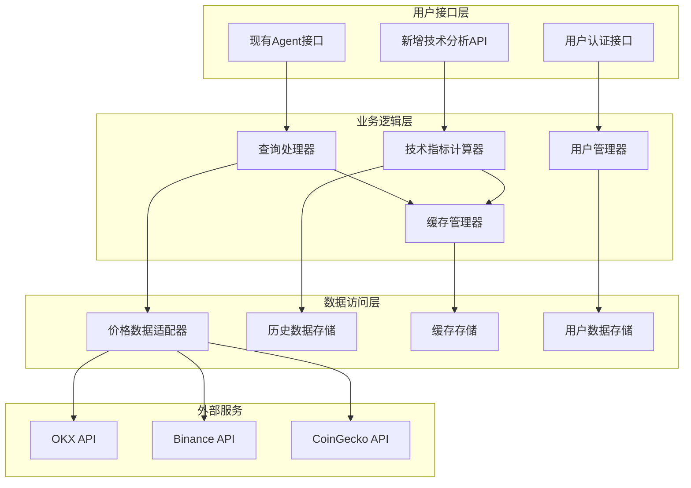

# 第一阶段：核心功能增强设计文档

## 系统架构设计

### 整体架构图



## 核心组件设计

### 1. 技术指标计算器 (TechnicalAnalyzer)

**职责**: 计算各种技术指标并提供分析结果

```python
from typing import List, Dict, Optional
import pandas as pd
import numpy as np
from dataclasses import dataclass
from datetime import datetime, timedelta

@dataclass
class TechnicalIndicators:
    """技术指标数据结构"""
    symbol: str
    timestamp: datetime
    rsi: Optional[float] = None
    macd: Optional[Dict[str, float]] = None
    bollinger_bands: Optional[Dict[str, float]] = None
    moving_averages: Optional[Dict[str, float]] = None
    volume_indicators: Optional[Dict[str, float]] = None

class TechnicalAnalyzer:
    """技术指标计算器"""
    
    def __init__(self, historical_data_manager):
        self.historical_data_manager = historical_data_manager
        self.supported_indicators = {
            'rsi': self._calculate_rsi,
            'macd': self._calculate_macd,
            'bollinger_bands': self._calculate_bollinger_bands,
            'sma': self._calculate_sma,
            'ema': self._calculate_ema
        }
    
    async def analyze(self, symbol: str, indicators: List[str] = None) -> TechnicalIndicators:
        """
        计算指定币种的技术指标
        
        Args:
            symbol: 币种代码
            indicators: 要计算的指标列表，None表示计算所有指标
        
        Returns:
            TechnicalIndicators: 技术指标结果
        """
        # 获取历史数据
        historical_data = await self.historical_data_manager.get_data(
            symbol, 
            period='30d',
            interval='1h'
        )
        
        if not historical_data:
            raise ValueError(f"无法获取 {symbol} 的历史数据")
        
        # 转换为DataFrame便于计算
        df = pd.DataFrame(historical_data)
        
        # 计算指定的技术指标
        indicators_to_calc = indicators or list(self.supported_indicators.keys())
        results = {}
        
        for indicator in indicators_to_calc:
            if indicator in self.supported_indicators:
                try:
                    results[indicator] = self.supported_indicators[indicator](df)
                except Exception as e:
                    print(f"计算 {indicator} 指标时出错: {e}")
                    results[indicator] = None
        
        return TechnicalIndicators(
            symbol=symbol,
            timestamp=datetime.now(),
            rsi=results.get('rsi'),
            macd=results.get('macd'),
            bollinger_bands=results.get('bollinger_bands'),
            moving_averages={
                'sma_20': results.get('sma'),
                'ema_12': results.get('ema')
            }
        )
    
    def _calculate_rsi(self, df: pd.DataFrame, period: int = 14) -> float:
        """计算RSI指标"""
        delta = df['close'].diff()
        gain = (delta.where(delta > 0, 0)).rolling(window=period).mean()
        loss = (-delta.where(delta < 0, 0)).rolling(window=period).mean()
        rs = gain / loss
        rsi = 100 - (100 / (1 + rs))
        return float(rsi.iloc[-1])
    
    def _calculate_macd(self, df: pd.DataFrame) -> Dict[str, float]:
        """计算MACD指标"""
        ema_12 = df['close'].ewm(span=12).mean()
        ema_26 = df['close'].ewm(span=26).mean()
        macd_line = ema_12 - ema_26
        signal_line = macd_line.ewm(span=9).mean()
        histogram = macd_line - signal_line
        
        return {
            'macd': float(macd_line.iloc[-1]),
            'signal': float(signal_line.iloc[-1]),
            'histogram': float(histogram.iloc[-1])
        }
    
    def _calculate_bollinger_bands(self, df: pd.DataFrame, period: int = 20) -> Dict[str, float]:
        """计算布林带指标"""
        sma = df['close'].rolling(window=period).mean()
        std = df['close'].rolling(window=period).std()
        
        return {
            'upper': float(sma.iloc[-1] + (std.iloc[-1] * 2)),
            'middle': float(sma.iloc[-1]),
            'lower': float(sma.iloc[-1] - (std.iloc[-1] * 2))
        }
    
    def _calculate_sma(self, df: pd.DataFrame, period: int = 20) -> float:
        """计算简单移动平均线"""
        return float(df['close'].rolling(window=period).mean().iloc[-1])
    
    def _calculate_ema(self, df: pd.DataFrame, period: int = 12) -> float:
        """计算指数移动平均线"""
        return float(df['close'].ewm(span=period).mean().iloc[-1])
```

### 2. 历史数据管理器 (HistoricalDataManager)

**职责**: 管理历史价格数据的获取、存储和缓存

```python
import sqlite3
import asyncio
from typing import List, Dict, Optional
from datetime import datetime, timedelta
import aiohttp

class HistoricalDataManager:
    """历史数据管理器"""
    
    def __init__(self, db_path: str = "historical_data.db"):
        self.db_path = db_path
        self.init_database()
        self.data_sources = [
            self._fetch_from_binance,
            self._fetch_from_okx,
            self._fetch_from_coingecko
        ]
    
    def init_database(self):
        """初始化数据库表结构"""
        conn = sqlite3.connect(self.db_path)
        cursor = conn.cursor()
        
        cursor.execute('''
            CREATE TABLE IF NOT EXISTS price_history (
                id INTEGER PRIMARY KEY AUTOINCREMENT,
                symbol TEXT NOT NULL,
                timestamp INTEGER NOT NULL,
                open_price REAL NOT NULL,
                high_price REAL NOT NULL,
                low_price REAL NOT NULL,
                close_price REAL NOT NULL,
                volume REAL NOT NULL,
                interval_type TEXT NOT NULL,
                data_source TEXT NOT NULL,
                created_at INTEGER NOT NULL,
                UNIQUE(symbol, timestamp, interval_type)
            )
        ''')
        
        # 创建索引提高查询性能
        cursor.execute('''
            CREATE INDEX IF NOT EXISTS idx_symbol_timestamp 
            ON price_history(symbol, timestamp)
        ''')
        
        conn.commit()
        conn.close()
    
    async def get_data(self, symbol: str, period: str = '30d', interval: str = '1h') -> List[Dict]:
        """
        获取历史数据，优先从本地数据库获取，不足时从API补充
        
        Args:
            symbol: 币种代码
            period: 时间周期 (1d, 7d, 30d)
            interval: 时间间隔 (1m, 5m, 1h, 1d)
        
        Returns:
            List[Dict]: 历史价格数据
        """
        # 计算需要的时间范围
        end_time = datetime.now()
        start_time = self._parse_period(period, end_time)
        
        # 先从数据库获取现有数据
        local_data = self._get_local_data(symbol, start_time, end_time, interval)
        
        # 检查数据完整性，补充缺失的数据
        missing_ranges = self._find_missing_ranges(local_data, start_time, end_time, interval)
        
        if missing_ranges:
            # 从API获取缺失的数据
            new_data = await self._fetch_missing_data(symbol, missing_ranges, interval)
            if new_data:
                # 保存到数据库
                self._save_to_database(new_data)
                # 合并数据
                local_data.extend(new_data)
        
        # 按时间排序并返回
        return sorted(local_data, key=lambda x: x['timestamp'])
    
    def _parse_period(self, period: str, end_time: datetime) -> datetime:
        """解析时间周期字符串"""
        period_map = {
            '1d': timedelta(days=1),
            '7d': timedelta(days=7),
            '30d': timedelta(days=30),
            '90d': timedelta(days=90)
        }
        
        if period not in period_map:
            raise ValueError(f"不支持的时间周期: {period}")
        
        return end_time - period_map[period]
    
    def _get_local_data(self, symbol: str, start_time: datetime, end_time: datetime, interval: str) -> List[Dict]:
        """从本地数据库获取数据"""
        conn = sqlite3.connect(self.db_path)
        cursor = conn.cursor()
        
        cursor.execute('''
            SELECT timestamp, open_price, high_price, low_price, close_price, volume
            FROM price_history
            WHERE symbol = ? AND timestamp >= ? AND timestamp <= ? AND interval_type = ?
            ORDER BY timestamp
        ''', (symbol, start_time.timestamp(), end_time.timestamp(), interval))
        
        rows = cursor.fetchall()
        conn.close()
        
        return [
            {
                'timestamp': row[0],
                'open': row[1],
                'high': row[2],
                'low': row[3],
                'close': row[4],
                'volume': row[5]
            }
            for row in rows
        ]
    
    async def _fetch_missing_data(self, symbol: str, missing_ranges: List, interval: str) -> List[Dict]:
        """从API获取缺失的数据"""
        all_data = []
        
        for start_time, end_time in missing_ranges:
            for fetch_func in self.data_sources:
                try:
                    data = await fetch_func(symbol, start_time, end_time, interval)
                    if data:
                        all_data.extend(data)
                        break  # 成功获取数据后跳出循环
                except Exception as e:
                    print(f"从数据源获取数据失败: {e}")
                    continue
        
        return all_data
    
    def _save_to_database(self, data: List[Dict]):
        """保存数据到数据库"""
        conn = sqlite3.connect(self.db_path)
        cursor = conn.cursor()
        
        for item in data:
            cursor.execute('''
                INSERT OR REPLACE INTO price_history 
                (symbol, timestamp, open_price, high_price, low_price, close_price, volume, interval_type, data_source, created_at)
                VALUES (?, ?, ?, ?, ?, ?, ?, ?, ?, ?)
            ''', (
                item['symbol'],
                item['timestamp'],
                item['open'],
                item['high'],
                item['low'],
                item['close'],
                item['volume'],
                item['interval'],
                item['source'],
                datetime.now().timestamp()
            ))
        
        conn.commit()
        conn.close()
```

### 3. 增强的缓存管理器 (EnhancedCacheManager)

**职责**: 提供多层缓存和智能缓存策略

```python
import redis
import json
import hashlib
from typing import Any, Optional, Dict
from datetime import datetime, timedelta

class EnhancedCacheManager:
    """增强的缓存管理器"""
    
    def __init__(self, redis_url: str = "redis://localhost:6379"):
        self.redis_client = redis.from_url(redis_url, decode_responses=True)
        self.memory_cache = {}  # 内存缓存
        self.cache_stats = {
            'hits': 0,
            'misses': 0,
            'memory_hits': 0,
            'redis_hits': 0
        }
    
    def _generate_cache_key(self, prefix: str, **kwargs) -> str:
        """生成缓存键"""
        key_data = json.dumps(kwargs, sort_keys=True)
        key_hash = hashlib.md5(key_data.encode()).hexdigest()
        return f"{prefix}:{key_hash}"
    
    async def get(self, prefix: str, **kwargs) -> Optional[Any]:
        """获取缓存数据"""
        cache_key = self._generate_cache_key(prefix, **kwargs)
        
        # 先检查内存缓存
        if cache_key in self.memory_cache:
            cache_item = self.memory_cache[cache_key]
            if cache_item['expires_at'] > datetime.now():
                self.cache_stats['hits'] += 1
                self.cache_stats['memory_hits'] += 1
                return cache_item['data']
            else:
                # 过期数据清理
                del self.memory_cache[cache_key]
        
        # 检查Redis缓存
        try:
            cached_data = self.redis_client.get(cache_key)
            if cached_data:
                data = json.loads(cached_data)
                # 同时更新内存缓存
                self.memory_cache[cache_key] = {
                    'data': data,
                    'expires_at': datetime.now() + timedelta(minutes=5)
                }
                self.cache_stats['hits'] += 1
                self.cache_stats['redis_hits'] += 1
                return data
        except Exception as e:
            print(f"Redis缓存读取失败: {e}")
        
        self.cache_stats['misses'] += 1
        return None
    
    async def set(self, prefix: str, data: Any, ttl_seconds: int = 300, **kwargs):
        """设置缓存数据"""
        cache_key = self._generate_cache_key(prefix, **kwargs)
        
        # 设置内存缓存
        self.memory_cache[cache_key] = {
            'data': data,
            'expires_at': datetime.now() + timedelta(seconds=min(ttl_seconds, 300))  # 内存缓存最多5分钟
        }
        
        # 设置Redis缓存
        try:
            self.redis_client.setex(
                cache_key,
                ttl_seconds,
                json.dumps(data, default=str)
            )
        except Exception as e:
            print(f"Redis缓存写入失败: {e}")
    
    def get_cache_stats(self) -> Dict[str, Any]:
        """获取缓存统计信息"""
        total_requests = self.cache_stats['hits'] + self.cache_stats['misses']
        hit_rate = (self.cache_stats['hits'] / total_requests * 100) if total_requests > 0 else 0
        
        return {
            'hit_rate': f"{hit_rate:.2f}%",
            'total_requests': total_requests,
            'memory_cache_size': len(self.memory_cache),
            **self.cache_stats
        }
    
    def clear_expired_memory_cache(self):
        """清理过期的内存缓存"""
        now = datetime.now()
        expired_keys = [
            key for key, item in self.memory_cache.items()
            if item['expires_at'] <= now
        ]
        
        for key in expired_keys:
            del self.memory_cache[key]
        
        return len(expired_keys)
```

### 4. 用户认证管理器 (UserAuthManager)

**职责**: 管理用户认证、API密钥和使用配额

```python
import sqlite3
import secrets
import hashlib
import jwt
from datetime import datetime, timedelta
from typing import Optional, Dict, Any

class UserAuthManager:
    """用户认证管理器"""
    
    def __init__(self, db_path: str = "users.db", jwt_secret: str = None):
        self.db_path = db_path
        self.jwt_secret = jwt_secret or secrets.token_urlsafe(32)
        self.init_database()
    
    def init_database(self):
        """初始化用户数据库"""
        conn = sqlite3.connect(self.db_path)
        cursor = conn.cursor()
        
        # 用户表
        cursor.execute('''
            CREATE TABLE IF NOT EXISTS users (
                id INTEGER PRIMARY KEY AUTOINCREMENT,
                username TEXT UNIQUE NOT NULL,
                email TEXT UNIQUE NOT NULL,
                password_hash TEXT NOT NULL,
                api_key TEXT UNIQUE NOT NULL,
                daily_quota INTEGER DEFAULT 1000,
                created_at INTEGER NOT NULL,
                last_login INTEGER,
                is_active BOOLEAN DEFAULT 1
            )
        ''')
        
        # API使用记录表
        cursor.execute('''
            CREATE TABLE IF NOT EXISTS api_usage (
                id INTEGER PRIMARY KEY AUTOINCREMENT,
                user_id INTEGER NOT NULL,
                api_key TEXT NOT NULL,
                endpoint TEXT NOT NULL,
                timestamp INTEGER NOT NULL,
                response_time_ms INTEGER,
                status_code INTEGER,
                FOREIGN KEY (user_id) REFERENCES users (id)
            )
        ''')
        
        # 创建索引
        cursor.execute('CREATE INDEX IF NOT EXISTS idx_api_key ON users(api_key)')
        cursor.execute('CREATE INDEX IF NOT EXISTS idx_usage_timestamp ON api_usage(timestamp)')
        
        conn.commit()
        conn.close()
    
    def create_user(self, username: str, email: str, password: str) -> Dict[str, Any]:
        """创建新用户"""
        conn = sqlite3.connect(self.db_path)
        cursor = conn.cursor()
        
        try:
            # 生成密码哈希和API密钥
            password_hash = hashlib.sha256(password.encode()).hexdigest()
            api_key = self._generate_api_key()
            
            cursor.execute('''
                INSERT INTO users (username, email, password_hash, api_key, created_at)
                VALUES (?, ?, ?, ?, ?)
            ''', (username, email, password_hash, api_key, datetime.now().timestamp()))
            
            user_id = cursor.lastrowid
            conn.commit()
            
            return {
                'user_id': user_id,
                'username': username,
                'email': email,
                'api_key': api_key,
                'daily_quota': 1000
            }
        
        except sqlite3.IntegrityError as e:
            raise ValueError(f"用户创建失败: {e}")
        finally:
            conn.close()
    
    def authenticate_api_key(self, api_key: str) -> Optional[Dict[str, Any]]:
        """验证API密钥"""
        conn = sqlite3.connect(self.db_path)
        cursor = conn.cursor()
        
        cursor.execute('''
            SELECT id, username, email, daily_quota, is_active
            FROM users
            WHERE api_key = ? AND is_active = 1
        ''', (api_key,))
        
        row = cursor.fetchone()
        conn.close()
        
        if row:
            return {
                'user_id': row[0],
                'username': row[1],
                'email': row[2],
                'daily_quota': row[3],
                'is_active': bool(row[4])
            }
        
        return None
    
    def check_rate_limit(self, user_id: int, api_key: str) -> Dict[str, Any]:
        """检查用户的使用配额"""
        conn = sqlite3.connect(self.db_path)
        cursor = conn.cursor()
        
        # 获取今日使用次数
        today_start = datetime.now().replace(hour=0, minute=0, second=0, microsecond=0)
        cursor.execute('''
            SELECT COUNT(*) FROM api_usage
            WHERE user_id = ? AND timestamp >= ?
        ''', (user_id, today_start.timestamp()))
        
        today_usage = cursor.fetchone()[0]
        
        # 获取用户配额
        cursor.execute('SELECT daily_quota FROM users WHERE id = ?', (user_id,))
        daily_quota = cursor.fetchone()[0]
        
        conn.close()
        
        return {
            'today_usage': today_usage,
            'daily_quota': daily_quota,
            'remaining': max(0, daily_quota - today_usage),
            'can_proceed': today_usage < daily_quota
        }
    
    def log_api_usage(self, user_id: int, api_key: str, endpoint: str, response_time_ms: int, status_code: int):
        """记录API使用情况"""
        conn = sqlite3.connect(self.db_path)
        cursor = conn.cursor()
        
        cursor.execute('''
            INSERT INTO api_usage (user_id, api_key, endpoint, timestamp, response_time_ms, status_code)
            VALUES (?, ?, ?, ?, ?, ?)
        ''', (user_id, api_key, endpoint, datetime.now().timestamp(), response_time_ms, status_code))
        
        conn.commit()
        conn.close()
    
    def _generate_api_key(self) -> str:
        """生成API密钥"""
        return f"ca_{secrets.token_urlsafe(32)}"  # ca = crypto agent
    
    def get_user_stats(self, user_id: int) -> Dict[str, Any]:
        """获取用户使用统计"""
        conn = sqlite3.connect(self.db_path)
        cursor = conn.cursor()
        
        # 今日使用统计
        today_start = datetime.now().replace(hour=0, minute=0, second=0, microsecond=0)
        cursor.execute('''
            SELECT COUNT(*), AVG(response_time_ms)
            FROM api_usage
            WHERE user_id = ? AND timestamp >= ?
        ''', (user_id, today_start.timestamp()))
        
        today_stats = cursor.fetchone()
        
        # 总使用统计
        cursor.execute('''
            SELECT COUNT(*), AVG(response_time_ms)
            FROM api_usage
            WHERE user_id = ?
        ''', (user_id,))
        
        total_stats = cursor.fetchone()
        
        conn.close()
        
        return {
            'today_requests': today_stats[0] or 0,
            'today_avg_response_time': round(today_stats[1] or 0, 2),
            'total_requests': total_stats[0] or 0,
            'total_avg_response_time': round(total_stats[1] or 0, 2)
        }
```

## API接口设计

### 增强的查询接口

```python
from fastapi import FastAPI, HTTPException, Depends, Header
from fastapi.security import HTTPBearer
from pydantic import BaseModel
from typing import Optional, List

app = FastAPI(title="Crypto Agent Enhanced API", version="1.1.0")

class TechnicalAnalysisRequest(BaseModel):
    symbol: str
    indicators: Optional[List[str]] = None
    include_basic_info: bool = True

class TechnicalAnalysisResponse(BaseModel):
    success: bool
    symbol: str
    basic_info: Optional[Dict] = None
    technical_indicators: Optional[Dict] = None
    timestamp: str
    response_time_ms: int

@app.post("/api/v1/technical-analysis")
async def get_technical_analysis(
    request: TechnicalAnalysisRequest,
    x_api_key: str = Header(None)
) -> TechnicalAnalysisResponse:
    """获取技术分析数据"""
    start_time = time.time()
    
    try:
        # 验证API密钥
        user = await authenticate_user(x_api_key)
        
        # 检查配额
        rate_limit = user_auth_manager.check_rate_limit(user['user_id'], x_api_key)
        if not rate_limit['can_proceed']:
            raise HTTPException(
                status_code=429,
                detail=f"已超过每日配额 {rate_limit['daily_quota']} 次"
            )
        
        # 获取基础价格信息（如果需要）
        basic_info = None
        if request.include_basic_info:
            basic_info = await crypto_agent.get_crypto_price(request.symbol)
        
        # 计算技术指标
        technical_data = await technical_analyzer.analyze(
            request.symbol,
            request.indicators
        )
        
        response_time = int((time.time() - start_time) * 1000)
        
        # 记录使用情况
        user_auth_manager.log_api_usage(
            user['user_id'],
            x_api_key,
            '/api/v1/technical-analysis',
            response_time,
            200
        )
        
        return TechnicalAnalysisResponse(
            success=True,
            symbol=request.symbol,
            basic_info=basic_info,
            technical_indicators=technical_data.__dict__,
            timestamp=datetime.now().isoformat(),
            response_time_ms=response_time
        )
        
    except Exception as e:
        response_time = int((time.time() - start_time) * 1000)
        
        # 记录错误
        if 'user' in locals():
            user_auth_manager.log_api_usage(
                user['user_id'],
                x_api_key,
                '/api/v1/technical-analysis',
                response_time,
                500
            )
        
        raise HTTPException(status_code=500, detail=str(e))

# 兼容现有接口的增强版本
@app.get("/api/crypto/{symbol}")
async def get_crypto_enhanced(
    symbol: str,
    include_technical: bool = False,
    technical_indicators: Optional[str] = None,
    x_api_key: str = Header(None)
):
    """增强的加密货币查询接口（向后兼容）"""
    
    # 基础价格查询
    basic_data = await crypto_agent.get_crypto_price(symbol)
    
    # 如果请求技术分析
    if include_technical and x_api_key:
        try:
            user = await authenticate_user(x_api_key)
            indicators = technical_indicators.split(',') if technical_indicators else None
            technical_data = await technical_analyzer.analyze(symbol, indicators)
            basic_data['technical_analysis'] = technical_data.__dict__
        except Exception as e:
            basic_data['technical_analysis_error'] = str(e)
    
    return basic_data
```

## 数据库设计

### 历史数据表结构

```sql
-- 价格历史数据表
CREATE TABLE price_history (
    id INTEGER PRIMARY KEY AUTOINCREMENT,
    symbol TEXT NOT NULL,                -- 币种代码
    timestamp INTEGER NOT NULL,          -- 时间戳
    open_price REAL NOT NULL,           -- 开盘价
    high_price REAL NOT NULL,           -- 最高价
    low_price REAL NOT NULL,            -- 最低价
    close_price REAL NOT NULL,          -- 收盘价
    volume REAL NOT NULL,               -- 交易量
    interval_type TEXT NOT NULL,        -- 时间间隔类型
    data_source TEXT NOT NULL,          -- 数据源
    created_at INTEGER NOT NULL,        -- 创建时间
    UNIQUE(symbol, timestamp, interval_type)
);

-- 用户表
CREATE TABLE users (
    id INTEGER PRIMARY KEY AUTOINCREMENT,
    username TEXT UNIQUE NOT NULL,
    email TEXT UNIQUE NOT NULL,
    password_hash TEXT NOT NULL,
    api_key TEXT UNIQUE NOT NULL,
    daily_quota INTEGER DEFAULT 1000,
    created_at INTEGER NOT NULL,
    last_login INTEGER,
    is_active BOOLEAN DEFAULT 1
);

-- API使用记录表
CREATE TABLE api_usage (
    id INTEGER PRIMARY KEY AUTOINCREMENT,
    user_id INTEGER NOT NULL,
    api_key TEXT NOT NULL,
    endpoint TEXT NOT NULL,
    timestamp INTEGER NOT NULL,
    response_time_ms INTEGER,
    status_code INTEGER,
    FOREIGN KEY (user_id) REFERENCES users (id)
);
```

## 部署配置

### Docker配置更新

```dockerfile
FROM python:3.9-slim

WORKDIR /app

# 安装系统依赖
RUN apt-get update && apt-get install -y \
    sqlite3 \
    redis-tools \
    && rm -rf /var/lib/apt/lists/*

# 复制依赖文件
COPY requirements.txt .

# 安装Python依赖
RUN pip install --no-cache-dir -r requirements.txt

# 复制应用代码
COPY . .

# 创建数据目录
RUN mkdir -p /app/data

# 暴露端口
EXPOSE 5000

# 环境变量
ENV FLASK_ENV=production
ENV DATABASE_PATH=/app/data/crypto_agent.db
ENV REDIS_URL=redis://redis:6379

# 启动命令
CMD ["python", "enhanced_app.py"]
```

### 配置管理

```python
import os
from dataclasses import dataclass

@dataclass
class Config:
    """应用配置"""
    # 数据库配置
    DATABASE_PATH: str = os.getenv('DATABASE_PATH', 'data/crypto_agent.db')
    HISTORICAL_DB_PATH: str = os.getenv('HISTORICAL_DB_PATH', 'data/historical_data.db')
    USERS_DB_PATH: str = os.getenv('USERS_DB_PATH', 'data/users.db')
    
    # Redis配置
    REDIS_URL: str = os.getenv('REDIS_URL', 'redis://localhost:6379')
    
    # API配置
    DEFAULT_CACHE_TTL: int = int(os.getenv('DEFAULT_CACHE_TTL', '300'))
    MAX_HISTORICAL_DAYS: int = int(os.getenv('MAX_HISTORICAL_DAYS', '90'))
    
    # 安全配置
    JWT_SECRET: str = os.getenv('JWT_SECRET', 'your-secret-key')
    API_KEY_PREFIX: str = os.getenv('API_KEY_PREFIX', 'ca_')
    
    # 性能配置
    MAX_CONCURRENT_REQUESTS: int = int(os.getenv('MAX_CONCURRENT_REQUESTS', '100'))
    REQUEST_TIMEOUT: int = int(os.getenv('REQUEST_TIMEOUT', '30'))

config = Config()
```

这个设计文档为第一阶段的核心功能增强提供了详细的技术实现方案，确保在不影响现有功能的基础上，平滑地添加技术分析、历史数据管理、缓存优化和用户认证等高级功能。