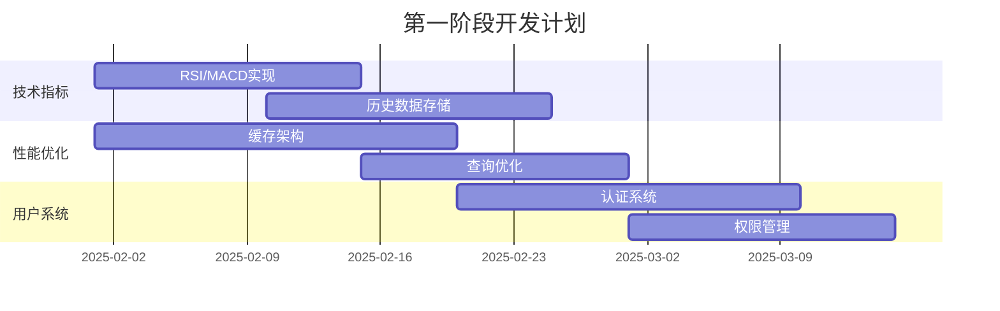

# 🗺️ 加密货币Agent集成工具包产品路线图

## 📋 项目概览

**项目名称**: 加密货币Agent集成工具包  
**项目愿景**: 成为AI Agent生态系统中最专业、最易用的加密货币数据集成解决方案  
**目标用户**: AI开发者、量化交易员、金融科技公司、个人投资者

## 🎯 产品定位

### 核心价值主张
- 🔌 **即插即用**: 5分钟内集成到任何AI系统
- 🌐 **多数据源**: 聚合全球主流交易所数据
- 🤖 **智能化**: 自然语言查询和AI驱动分析
- 📊 **专业级**: 企业级可靠性和安全性

### 竞争优势
1. **多框架支持**: 唯一支持Kiro IDE、LangChain、OpenAI Functions等多种AI框架
2. **实时性**: 毫秒级数据更新和推送
3. **智能化**: 内置NLP和机器学习能力
4. **开源生态**: 完全开源，社区驱动发展

## 🚀 发展阶段规划

### 🌱 第一阶段：核心功能增强 (1-3个月)
**目标**: 从MVP到生产就绪的专业工具

#### 主要功能
- ✅ **技术分析**: RSI、MACD、布林带等20+技术指标
- ✅ **性能优化**: 多层缓存，响应时间<500ms
- ✅ **用户系统**: 认证、权限、配额管理
- ✅ **历史数据**: 支持多时间周期历史查询

#### 成功指标
- 响应时间: < 500ms (95%ile)
- 系统可用性: > 99.5%
- 用户增长: 100+ 注册用户
- GitHub Stars: 50+

#### 技术里程碑


### 🌿 第二阶段：生态系统扩展 (3-6个月)
**目标**: 构建完整的加密货币数据生态系统

#### 主要功能
- 🔗 **DeFi集成**: Uniswap、PancakeSwap等DEX数据
- 📰 **新闻分析**: 实时新闻和情感分析
- 💼 **投资组合**: 持仓跟踪和风险管理
- 🔍 **套利发现**: 跨交易所价格差异识别

#### 成功指标
- 数据源数量: 20+ 交易所和协议
- 用户增长: 500+ 活跃用户
- API调用量: 100万+ 次/月
- GitHub Stars: 200+

#### 商业化探索
- 💰 **付费计划**: 高频用户付费订阅
- 🏢 **企业服务**: 定制化企业解决方案
- 🤝 **合作伙伴**: 与交易所和数据提供商合作

### 🌳 第三阶段：智能化升级 (6-12个月)
**目标**: AI驱动的智能投资助手

#### 主要功能
- 🧠 **AI预测**: 基于深度学习的价格预测
- 🌍 **国际化**: 支持10+语言和地区
- 📊 **高级图表**: 专业级交易图表和分析
- 🎯 **个性化**: 基于用户行为的个性化推荐

#### 成功指标
- 预测准确率: > 65%
- 国际用户占比: > 30%
- 用户留存率: > 80% (月留存)
- 收入增长: 10倍增长

#### 技术创新
- 🤖 **AutoML**: 自动化机器学习模型训练
- ⚡ **实时计算**: 流式数据处理和实时分析
- 🔐 **隐私计算**: 联邦学习和差分隐私

### 🌲 第四阶段：企业级平台 (12个月+)
**目标**: 成为行业标准的企业级解决方案

#### 主要功能
- 🏭 **企业部署**: 私有云和混合云部署
- 🔧 **开放平台**: 第三方开发者生态系统
- 📈 **大数据分析**: 海量数据处理和分析
- 🛡️ **合规安全**: 金融级安全和合规认证

#### 成功指标
- 企业客户: 50+ 企业用户
- 开发者生态: 1000+ 注册开发者
- 平台收入: 年收入100万美元
- 市场地位: 细分领域前3名

## 📊 市场分析

### 目标市场规模
- **TAM** (总体市场): $50B (全球金融科技市场)
- **SAM** (可服务市场): $5B (加密货币工具和服务)
- **SOM** (可获得市场): $500M (AI驱动的加密货币工具)

### 用户画像分析

#### 主要用户群体
1. **AI开发者** (40%)
   - 需求: 快速集成加密货币功能
   - 痛点: 数据源分散，集成复杂
   - 价值: 节省开发时间，提高产品质量

2. **量化交易员** (30%)
   - 需求: 高质量数据和分析工具
   - 痛点: 数据延迟，分析工具不足
   - 价值: 提高交易策略效果

3. **金融科技公司** (20%)
   - 需求: 企业级解决方案
   - 痛点: 合规要求，系统稳定性
   - 价值: 降低开发成本，加速产品上市

4. **个人投资者** (10%)
   - 需求: 简单易用的投资工具
   - 痛点: 信息过载，决策困难
   - 价值: 智能化投资建议

### 竞争对手分析

| 竞争对手 | 优势 | 劣势 | 我们的差异化 |
|---------|------|------|-------------|
| CoinGecko API | 数据全面 | 单一接口，无AI功能 | 多框架集成+AI分析 |
| Alpha Vantage | 传统金融数据 | 加密货币支持有限 | 专注加密货币生态 |
| Messari API | 专业数据 | 价格昂贵 | 开源免费+社区驱动 |
| TradingView | 图表功能强 | 不支持AI集成 | 原生AI Agent支持 |

## 💰 商业模式

### 收入模式
1. **免费增值** (Freemium)
   - 免费: 基础API调用 (1000次/月)
   - 付费: 高级功能和更高配额

2. **订阅服务** (SaaS)
   - 个人版: $9/月 (10万次调用)
   - 专业版: $49/月 (100万次调用)
   - 企业版: $199/月 (无限调用+支持)

3. **企业服务** (Enterprise)
   - 私有部署: $10,000起
   - 定制开发: $50,000起
   - 技术支持: $5,000/月

4. **数据服务** (Data as a Service)
   - 高级数据源: $0.001/次调用
   - 实时数据流: $100/月
   - 历史数据: $500/TB

### 收入预测

| 阶段 | 时间 | 用户数 | 月收入 | 年收入 |
|------|------|--------|--------|--------|
| 第一阶段 | 3个月 | 100 | $500 | $6K |
| 第二阶段 | 6个月 | 500 | $5K | $60K |
| 第三阶段 | 12个月 | 2000 | $25K | $300K |
| 第四阶段 | 24个月 | 5000 | $100K | $1.2M |

## 🛠️ 技术路线图

### 架构演进

#### 当前架构 (v1.0)
```
单体应用 → Flask API → 外部数据源
```

#### 目标架构 (v2.0)
```
微服务架构 → API网关 → 服务网格 → 多数据源
```

#### 未来架构 (v3.0)
```
云原生 → Kubernetes → 服务网格 → 边缘计算
```

### 技术栈演进

| 组件 | 当前 | 第二阶段 | 第三阶段 | 第四阶段 |
|------|------|----------|----------|----------|
| 后端 | Flask | FastAPI | 微服务 | 云原生 |
| 数据库 | SQLite | PostgreSQL | 分布式DB | 多模数据库 |
| 缓存 | 内存 | Redis | Redis集群 | 分布式缓存 |
| 消息队列 | 无 | RabbitMQ | Kafka | 云消息服务 |
| 监控 | 基础日志 | Prometheus | 全链路追踪 | AIOps |

### 关键技术决策

1. **编程语言**: Python (易于AI集成) + Go (高性能服务)
2. **数据库**: PostgreSQL (关系数据) + ClickHouse (时序数据)
3. **缓存**: Redis (内存缓存) + CDN (边缘缓存)
4. **消息队列**: Apache Kafka (高吞吐量)
5. **容器化**: Docker + Kubernetes
6. **云平台**: 多云策略 (AWS + Azure + GCP)

## 📈 关键指标 (KPIs)

### 产品指标
- **用户增长率**: 月增长 > 20%
- **用户留存率**: 月留存 > 70%
- **API调用量**: 月增长 > 50%
- **响应时间**: P95 < 500ms
- **系统可用性**: > 99.9%

### 业务指标
- **收入增长率**: 季度增长 > 100%
- **客户获取成本** (CAC): < $50
- **客户生命周期价值** (LTV): > $500
- **LTV/CAC比率**: > 10:1
- **月经常性收入** (MRR): 持续增长

### 技术指标
- **代码覆盖率**: > 90%
- **部署频率**: 每周 > 5次
- **故障恢复时间**: < 1小时
- **安全漏洞**: 0个高危漏洞
- **性能回归**: 0个性能下降

## 🎯 里程碑规划

### 2025年Q1 (第一阶段启动)
- [ ] 技术指标模块上线
- [ ] 用户认证系统完成
- [ ] 性能优化达标
- [ ] 获得100个注册用户

### 2025年Q2 (第一阶段完成)
- [ ] 历史数据服务上线
- [ ] 缓存架构优化完成
- [ ] 价格预警功能发布
- [ ] GitHub Stars达到50+

### 2025年Q3 (第二阶段启动)
- [ ] DeFi协议集成完成
- [ ] 新闻分析功能上线
- [ ] 投资组合管理发布
- [ ] 用户数达到500+

### 2025年Q4 (第二阶段完成)
- [ ] 套利发现功能上线
- [ ] 商业化模式启动
- [ ] 企业客户获取
- [ ] 年收入达到$60K

### 2026年H1 (第三阶段启动)
- [ ] AI预测模型上线
- [ ] 多语言支持完成
- [ ] 高级图表功能发布
- [ ] 国际市场扩展

### 2026年H2 (第三阶段完成)
- [ ] 个性化推荐系统
- [ ] 实时计算平台
- [ ] 用户数达到2000+
- [ ] 年收入达到$300K

## 🚨 风险评估与应对

### 技术风险
| 风险 | 概率 | 影响 | 应对策略 |
|------|------|------|----------|
| API稳定性 | 中 | 高 | 多数据源备份 |
| 性能瓶颈 | 中 | 中 | 架构优化 |
| 安全漏洞 | 低 | 高 | 安全审计 |

### 市场风险
| 风险 | 概率 | 影响 | 应对策略 |
|------|------|------|----------|
| 竞争加剧 | 高 | 中 | 差异化竞争 |
| 监管变化 | 中 | 高 | 合规预案 |
| 市场萎缩 | 低 | 高 | 多元化发展 |

### 运营风险
| 风险 | 概率 | 影响 | 应对策略 |
|------|------|------|----------|
| 团队流失 | 中 | 中 | 激励机制 |
| 资金短缺 | 低 | 高 | 融资计划 |
| 技术债务 | 中 | 中 | 重构计划 |

## 🤝 团队与资源

### 核心团队需求
- **技术负责人** (1人): 架构设计和技术决策
- **后端工程师** (2人): API开发和数据处理
- **前端工程师** (1人): 用户界面和体验
- **AI工程师** (1人): 机器学习和数据分析
- **DevOps工程师** (1人): 基础设施和部署
- **产品经理** (1人): 产品规划和用户研究

### 资源需求
- **开发成本**: $50K/月 (人员成本)
- **基础设施**: $5K/月 (云服务成本)
- **第三方服务**: $2K/月 (API和工具)
- **营销推广**: $10K/月 (用户获取)
- **总计**: $67K/月

### 融资计划
- **种子轮**: $500K (6个月运营)
- **A轮**: $2M (18个月发展)
- **B轮**: $10M (全球扩张)

## 📚 学习与改进

### 用户反馈机制
- **用户调研**: 月度用户访谈
- **数据分析**: 用户行为分析
- **A/B测试**: 功能效果验证
- **社区反馈**: GitHub Issues和讨论

### 持续改进流程
1. **数据收集**: 用户行为和反馈数据
2. **分析洞察**: 识别问题和机会
3. **假设验证**: 快速原型和测试
4. **迭代优化**: 基于结果持续改进

### 知识管理
- **技术文档**: 架构和API文档
- **最佳实践**: 开发和运维规范
- **经验总结**: 项目复盘和学习
- **知识分享**: 团队培训和分享

---

## 🎉 总结

这份产品路线图为加密货币Agent集成工具包描绘了一个清晰的发展蓝图：

- 🎯 **明确愿景**: 成为AI Agent生态系统中最专业的加密货币数据解决方案
- 📈 **分阶段发展**: 从MVP到企业级平台的4个发展阶段
- 💰 **可持续商业模式**: 免费增值+订阅服务+企业服务
- 🛠️ **技术路线清晰**: 从单体应用到云原生架构的技术演进
- 📊 **量化目标**: 明确的KPIs和里程碑
- 🚨 **风险可控**: 全面的风险评估和应对策略

通过这个路线图的执行，我们有信心将这个项目打造成加密货币和AI领域的标杆产品，为用户创造巨大价值，同时建立可持续的商业成功。

**下一步行动**: 立即开始第一阶段的开发工作，专注于核心功能的完善和用户体验的优化！ 🚀